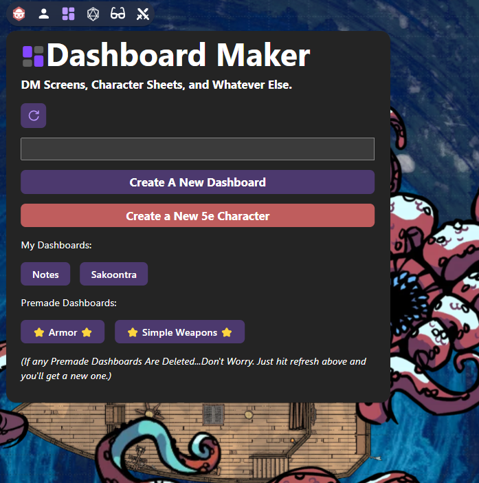
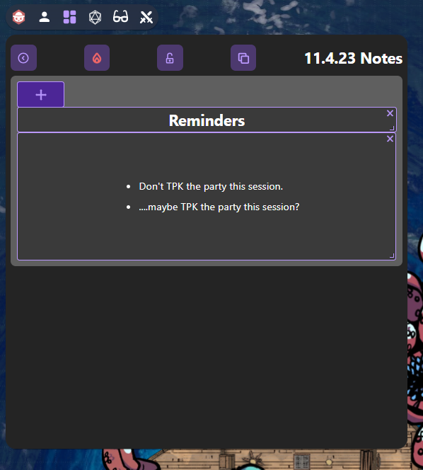
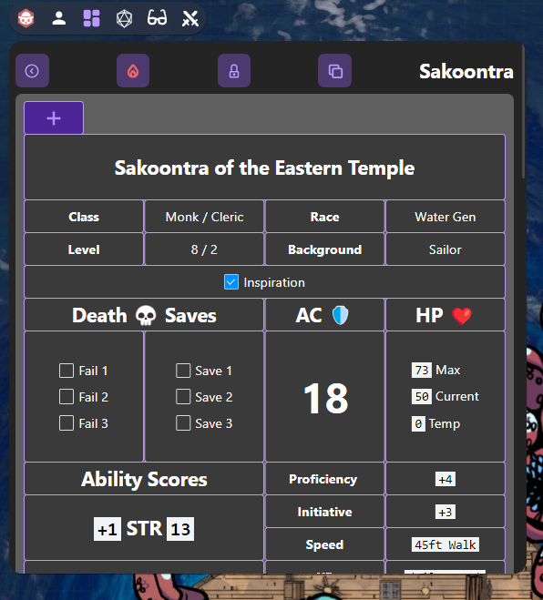
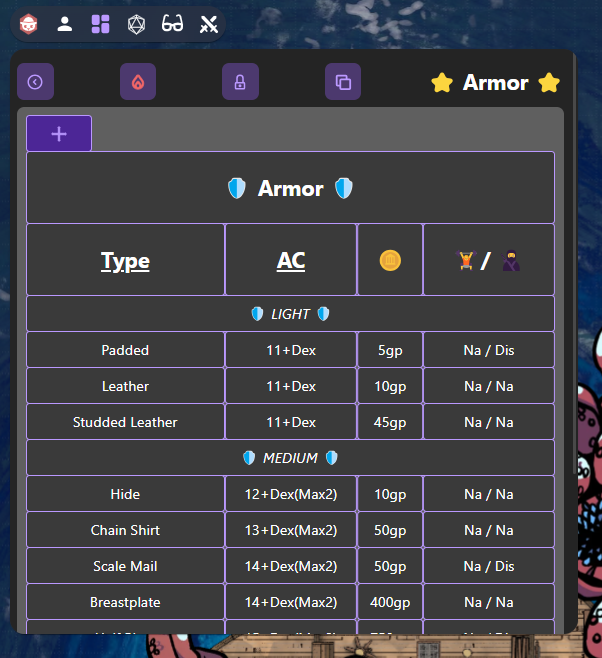

# Dashboard Maker

**An Owlbear Rodeo extension for keeping game content you need on hand.**

Whether it's useful notes & reminders, initiative trackers, character sheets, or something else, Dashboard Maker is a place to put it. All content is saved in your browser.

The more you put in Dashboard Maker, the less you have to leave Owlbear Rodeo. Why is this good? Because context switching during a game sucks.

Check it out as a standalone app here: https://owlbear-dashboard-maker.vercel.app/

_(But really, you should be using this in [Owlbear Rodeo](https://www.owlbear.rodeo/))_

## Features

**Create Dashboards!**

### Blank Dashboards

Click **Create A New Dashboard** on the home screen to create a new empty dashboard space.

---

### 5e Character Template Dashboards

Click **Create A New 5e Character** on the home page to create a new dashboard space using a 5e Character Template.

### Premades

Dashboard Maker comes with a couple of "Premades". These are dashboards that are already there, with some useful DM Screen info particular to D&D 5th Edition.

More "Premades" to come.

## Additional Features
- You can delete dashboards as needed
- You can clone/duplicate any dashboard as needed
- You can lock/unlock the state of a dashboard, affecting the editable boxes within it.

_Have fun!_
